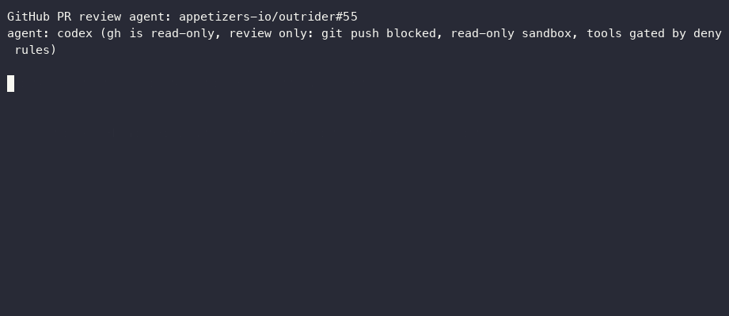

# outrider

*Rides ahead of your review queue.*

[](https://github.com/appetizers-io/outrider/actions/workflows/ci.yml)
[](https://github.com/appetizers-io/outrider/releases/latest)
[](LICENSE)
[](go.mod)

outrider watches your GitHub notifications and opens a local coding agent
(Claude Code or Codex) for the pull requests that need you: in its own
worktree, in your terminal, with guardrails around pushing and posting.

<!-- Demo: record one launch and replace this comment, e.g.
     asciinema rec demo.cast -c "outrider --once"
     agg demo.cast docs/demo.gif
     then add:  -->

## What it does

- **Watches PR activity**: your own PRs, @mentions, replies to your review
  comments, and PRs you opt in to with a 👀 reaction. Notifications stay unread.
- **Asks first**: a launch check (Jev or your own classifier) skips bot noise
  and LGTMs before a session starts.
- **Starts a local session**: a git worktree per PR, a prompt that says what
  happened, and the agent in a terminal window or tmux.
- **Keeps guardrails on**: someone else's PR is review only; pushes and GitHub
  posts wait for your click in a native dialog; merges and other PRs are off
  limits.

## Install

| Platform | How |
|---|---|
| macOS (Linux: see [notes](docs/development.md#homebrew-tap)) | `brew install appetizers-io/tap/outrider`, after the first public release |
| macOS, Linux, Windows | Download an archive from [releases](https://github.com/appetizers-io/outrider/releases/latest) and put `outrider` on your `PATH` |
| Any, with Go 1.27 | `go install github.com/appetizers-io/outrider@latest` |
| From a checkout | `task install` (builds into `~/.local/bin`) |

outrider needs [`gh`](https://cli.github.com) (logged in), `git`, and
`claude` or `codex`. tmux is only needed for the tmux launcher.

## Quickstart

```sh
cd ~/dev/some-repo                  # watches this checkout's GitHub repo
outrider doctor                     # 1. check gh, git, the agent, the terminal; says what to fix
outrider --dry-run --once           # 2. see what would launch; changes nothing
outrider --agent claude             # 3. run it; sessions open as PRs need you
outrider config generate --write    # 4. write a documented config to edit
```

[Getting started](docs/getting-started.md) walks through the first run and
the startup log.

## Safety model

Sessions on other people's PRs are review only, and every push and post can
require your click. These guardrails **catch an agent's mistakes; they are
not a sandbox.** The agent runs as you, with your credentials. For PRs from
people you don't trust, use `sandbox: read-only` (or only
`others_prs.sandbox: read-only`): the session then runs in Claude Code's or
Codex's own OS sandbox and can't write files, commit, push, post or reach
the network. [Safety](docs/safety.md) lists what is and isn't enforced.

## Documentation

| Page | Covers |
|---|---|
| [Getting started](docs/getting-started.md) | Prerequisites, first run, what you'll see |
| [How it works](docs/how-it-works.md) | Poll, triggers, launch check, worktree, session, guards |
| [Triggers](docs/triggers.md) | Own PRs, @mentions, 👀 opt-in, review replies |
| [Safety](docs/safety.md) | Modes, push and post approval, guards, tool gate |
| [Configuration](docs/configuration.md) | The config file by topic, flags, the schema |
| [Classifiers](docs/classifiers.md) | Jev, your own launch check and tool gate |
| [Terminals](docs/terminals.md) | Terminal detection, tmux, Windows |
| [Recipes](docs/recipes.md) | Forks, bots, Codex, background service, many repos |
| [Examples](docs/examples/README.md) | Example configs, classifier scripts, service files |
| [Troubleshooting](docs/troubleshooting.md) | Common errors, reading the startup log |
| [Development](docs/development.md) | Tasks, code layout, releases |

## Contributing

See [CONTRIBUTING.md](CONTRIBUTING.md). Maintainers are listed in
[MAINTAINERS.md](MAINTAINERS.md). Please report security problems privately
to a maintainer, not in a public issue.

## License

[Apache-2.0](LICENSE)
