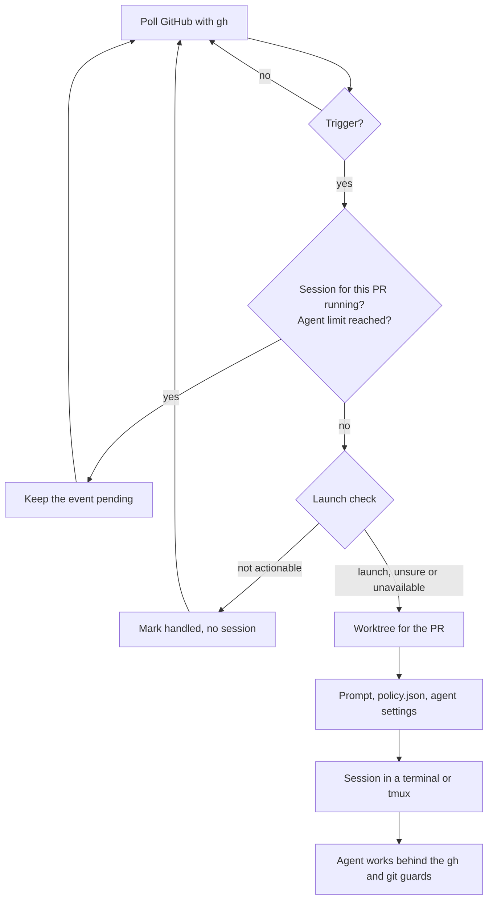

# How it works

## 1. Poll

Every `interval_seconds` (default 60) outrider reads your notifications with
`gh api`, including read ones, from the last `lookback_hours` (default 168).
It never marks a notification read. It also searches open PRs you're involved
in, so an opt-in reaction on an older PR still counts. Repeated failures back
off up to 15 minutes.

What was handled is kept in `~/.local/state/outrider/state.json`. `--dry-run`
never writes it.

## 2. Triggers

A trigger decides that new activity on a PR may need you. There are four:
your own PRs, @mentions, the 👀 opt-in and replies to your review comments.
See [Triggers](triggers.md).

## 3. Launch check

Before a session starts, a classifier answers one question about the new
activity: should an agent act on it now? Bot summaries, approvals and LGTMs
get skipped. Anything but a confident "no" launches, so an unsure or
unreachable classifier never swallows real feedback. The 👀 opt-in skips the
check; you asked for it explicitly. See [Classifiers](classifiers.md).

## 4. Worktree

Each PR gets its own worktree, `~/.cache/outrider/worktrees/<owner>__<repo>/pr-<n>`,
on a local branch `review/pr-<n>` checked out with `gh pr checkout`. When
you run outrider inside a checkout of the repo, worktrees branch off that
checkout; otherwise it clones the repo once into `~/.cache/outrider/repos/`.
A worktree with local changes is kept as it is.

## 5. Session

outrider writes the session files to
`~/.cache/outrider/sessions/<owner>__<repo>/pr-<n>/`:

| File | Purpose |
|---|---|
| `prompt.txt` | what happened, what the agent may do on this PR, the rules for GitHub |
| `policy.json` | the same rules as data: review only or not, push and post modes, scope, deny rules, tool gate |
| `claude-settings.json` | Claude only, supervised mode: deny rules and the tool-gate hook |
| `session.json` | everything the session runner needs |

Then it opens a terminal window or a tmux session that runs
`outrider session run <dir>`. That runner holds a lock for the PR, puts the
guards first on `PATH`, starts the agent with the prompt, and removes the lock
when the agent exits. See [Terminals](terminals.md).

Sessions for a reply or a mention are scoped: the prompt names the comments and
tells the agent to handle only them.

## 6. Guards

The agent's `gh` and `git` are the outrider binary itself (links in
`~/.cache/outrider/bin`). They pass reads, refuse merges, closes and writes to
other PRs, and ask you in a native dialog before a push or a post when the mode
is `ask`. See [Safety](safety.md) for what they cover and what they don't.
